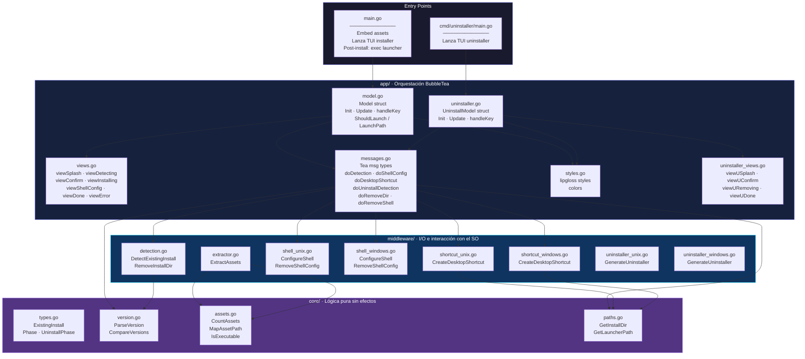
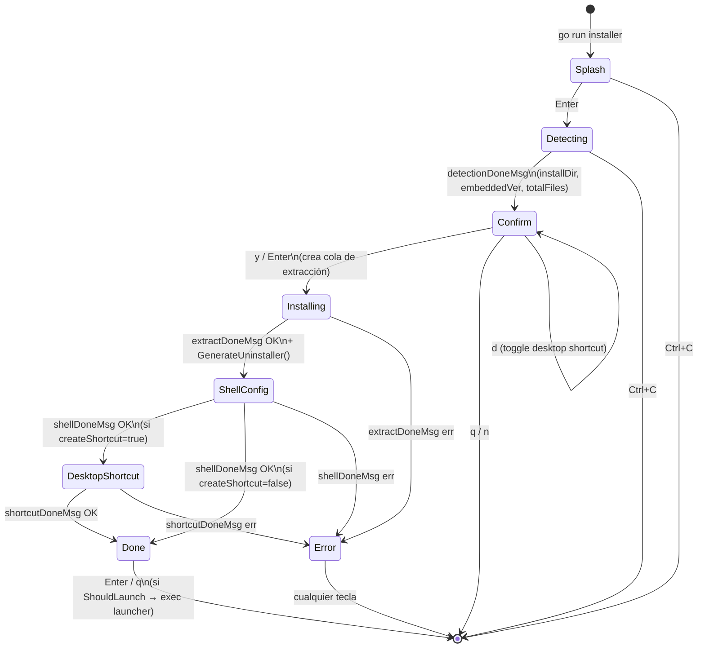
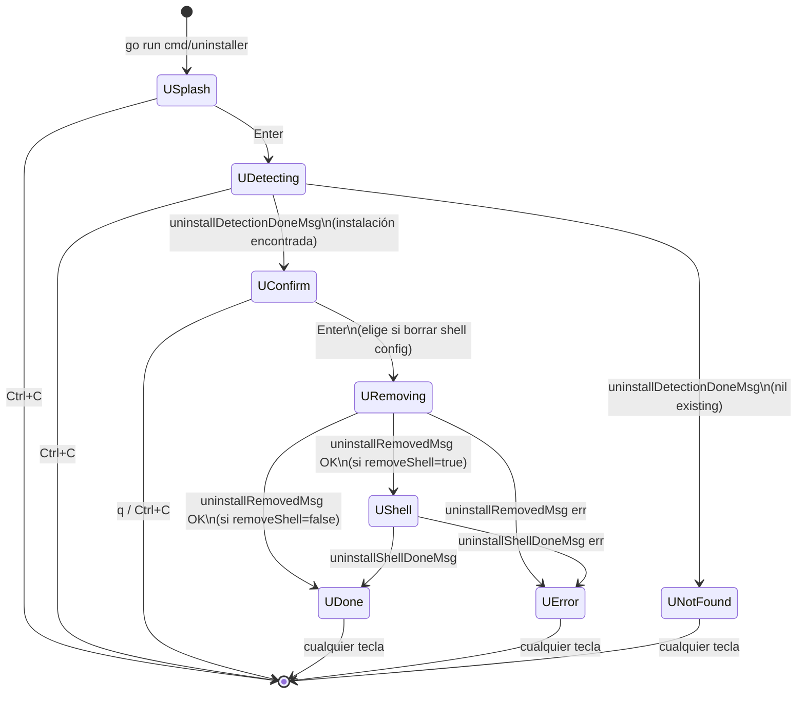

# installer-go – Arquitectura y Flujo

## Capas de la arquitectura



---

## Flujo del Installer



---

## Flujo del Uninstaller



---

## Mapa de archivos

| Capa | Archivo | Responsabilidad |
|------|---------|-----------------|
| `core/` | `types.go` | `ExistingInstall`, `Phase`, `UninstallPhase` |
| `core/` | `version.go` | `ParseVersion`, `CompareVersions` |
| `core/` | `assets.go` | `CountAssets`, `MapAssetPath`, `IsExecutable` |
| `core/` | `paths.go` | `GetInstallDir`, `GetLauncherPath` |
| `middleware/` | `detection.go` | `DetectExistingInstall`, `RemoveInstallDir` |
| `middleware/` | `extractor.go` | `ExtractAssets` |
| `middleware/` | `shell_unix.go` | `ConfigureShell`, `RemoveShellConfig` (Linux/macOS) |
| `middleware/` | `shell_windows.go` | `ConfigureShell`, `RemoveShellConfig` (Windows) |
| `middleware/` | `shortcut_unix.go` | `CreateDesktopShortcut` (Linux/macOS) |
| `middleware/` | `shortcut_windows.go` | `CreateDesktopShortcut` (Windows) |
| `middleware/` | `uninstaller_unix.go` | `GenerateUninstaller` → `uninstaller.sh` |
| `middleware/` | `uninstaller_windows.go` | `GenerateUninstaller` → `uninstaller.ps1` |
| `app/` | `model.go` | `Model`, `NewModel`, `Init`, `Update`, `handleKey` |
| `app/` | `views.go` | `View()` + renders de cada fase |
| `app/` | `messages.go` | Tipos Tea msg + cmd factories |
| `app/` | `styles.go` | Colores y estilos lipgloss |
| `app/` | `uninstaller.go` | `UninstallModel`, `NewUninstallModel`, `Update` |
| `app/` | `uninstaller_views.go` | Renders del uninstaller |
| `.` | `main.go` | Entry point installer: embed FS → TUI → exec launcher |
| `cmd/uninstaller/` | `main.go` | Entry point uninstaller: TUI |
| `.` | `embed.go` | `//go:embed assets` → `assetsFS` |

---

## Reglas de capas

```
core/        → solo stdlib sin I/O real (excepto os.UserHomeDir)
middleware/  → puede importar core/. I/O libre (os.*, embed, exec)
app/         → puede importar core/ y middleware/. BubbleTea libre
main.go      → importa solo app/ y embed
```
