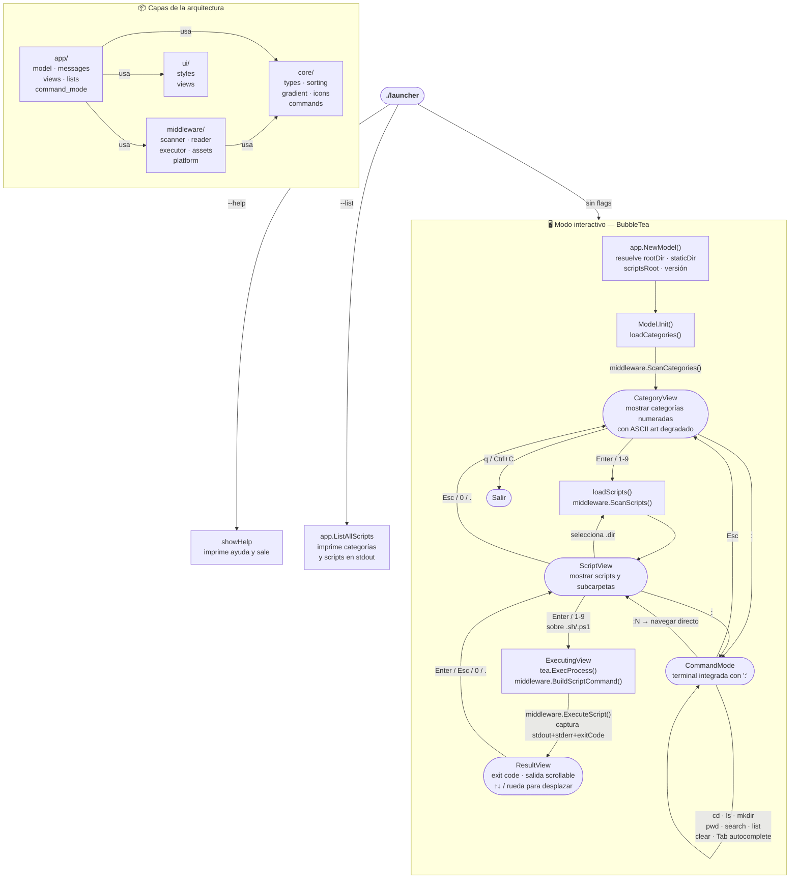

# DevLauncher — Arquitectura y flujo de ejecución

## Estructura de capas

El proyecto sigue una arquitectura funcional estricta en tres capas. Las dependencias **solo fluyen hacia abajo**; ninguna capa inferior conoce a las superiores.

```
main.go
  └── app/          ← orquestación BubbleTea (estado, eventos, renderizado)
        ├── core/   ← lógica pura: tipos, ordenamiento, gradiente, comandos
        ├── middleware/ ← I/O: filesystem, ejecución de procesos, assets
        └── ui/     ← estilos lipgloss, breadcrumb, header de fallback
```

### `core/`

Funciones **puras** — sin I/O, sin estado global, 100% testeables sin mocks.

| Archivo | Responsabilidad |
|---|---|
| `types.go` | `Script`, `Category`, `ViewState` y sus constantes |
| `sorting.go` | `SortCategories`, `SortScripts` (devuelven nuevas slices) |
| `gradient.go` | `ApplyGradient` — colorea líneas de ASCII art |
| `icons.go` | `CategoryIcon`, `CategoryDescription` (lookups de strings) |
| `commands.go` | `LongestCommonPrefix`, `SplitCommandAndArg`, `CommandSuggestions` |

### `middleware/`

Funciones **impuras** — interactúan con el sistema. Reciben dependencias como parámetros, nunca usan globales.

| Archivo | Responsabilidad |
|---|---|
| `platform.go` | `GetScriptsPath`, `GetStaticPath` — resolución de rutas según el SO |
| `reader.go` | `ReadLauncherVersion`, `extractDescription`, `readmeFolderMeta` |
| `scanner.go` | `ScanCategories`, `ScanScripts` — escaneo del sistema de archivos |
| `executor.go` | `BuildScriptCommand`, `ExecuteScript` — ejecuta `.sh`, `.ps1`, `.bat` |
| `assets.go` | `LoadASCIIArt` — carga un `.txt` aleatorio de `static/` |

### `app/`

Orquestación BubbleTea. Sin lógica de negocio propia: conecta `core/` y `middleware/`.

| Archivo | Responsabilidad |
|---|---|
| `model.go` | `Model`, `NewModel`, `Init`, `Update` |
| `messages.go` | Tipos `tea.Msg` + factories `loadCategories`, `loadScripts`, `executeScript` |
| `views.go` | `View()` y funciones `render*` por estado; `ListAllScripts` (modo `--list`) |
| `lists.go` | Adaptadores `categoryItem`, `scriptItem` para el componente `list.Model` |
| `command_mode.go` | `CommandMode` — terminal integrada con autocompletado |

### `ui/`

Solo estilos `lipgloss` y helpers de renderizado sin I/O.

| Archivo | Responsabilidad |
|---|---|
| `styles.go` | Colores, estilos, constantes de cajas, `DrawSeparator` |
| `views.go` | `RenderBreadcrumb`, `RenderFallbackHeader` |

---

## Flujo de ejecución



---

## Estados de la TUI

| Estado | Descripción | Teclas principales |
|---|---|---|
| `CategoryView` | Lista de categorías con ASCII art y versión | `1-9`, `↑↓`, `Enter`, `:`, `q` |
| `ScriptView` | Scripts y subcarpetas de la categoría activa | `1-9`, `↑↓`, `Enter`, `Esc`/`0`/`.`, `:` |
| `ExecutingView` | Pantalla de espera mientras corre el script | — (automático) |
| `ResultView` | Salida del script con scroll | `↑↓`/`j`/`k`, `Enter`/`Esc`/`0`/`.`, `q` |
| `CommandMode` | Terminal integrada (overlay sobre cualquier estado) | `Tab`, `Enter`, `Esc` |

## Ciclo de vida de un mensaje BubbleTea

```
evento (teclado / ratón / sistema)
        │
        ▼
  Model.Update(msg)
        │
        ├─ tea.KeyMsg  → modifica estado o dispara un tea.Cmd
        ├─ tea.MouseMsg → scroll en ResultView o CommandMode
        ├─ categoriesLoadedMsg → actualiza m.categories + m.categoryList
        ├─ scriptsLoadedMsg    → actualiza m.scripts + m.scriptList
        ├─ scriptExecutedMsg   → guarda exitCode + output, cambia a ResultView
        └─ errorMsg            → guarda m.err
        │
        ▼
  Model.View()  → renderiza el estado actual como string
```

## Detección de `rootDir`

`app.NewModel` localiza el directorio raíz del proyecto con dos estrategias:

1. Busca `scripts/` en el directorio de trabajo actual o en su padre (`..`).
2. Si no lo encuentra, usa el directorio del propio ejecutable resolviendo symlinks.

Esto permite ejecutar `./launcher` tanto desde `launcher-go/` durante el desarrollo como desde cualquier ruta del sistema tras la instalación.
